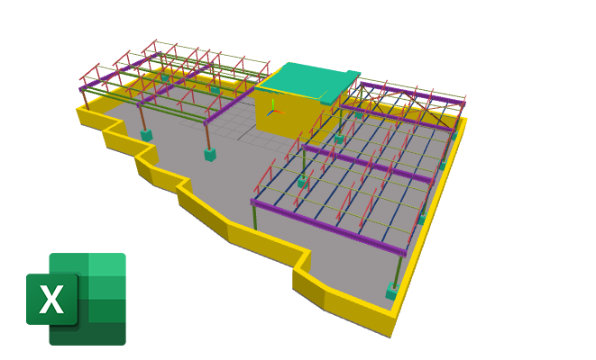

# Description

Demo Easy Convert Data From IFC To Excel



## Installation

```bash
%pip install ifcopenshell --upgrade
%pip install openxml --upgrade
%pip install pandas --upgrade
```

## Usage

```python
# copyring by chuongmep
import ifcopenshell
import pandas as pd
import warnings
warnings.filterwarnings('ignore')
#----#
file_path = r"2022020320211122Wellness center Sama.ifc"
ifc_file = ifcopenshell.open(file_path)
classes = ifc_file.by_type("IfcProduct")
# print all class name
class_names = [class_name.is_a() for class_name in classes]
class_names = list(set(class_names))
file_name = "result.xlsx"
with pd.ExcelWriter(file_name, engine='openpyxl') as writer:
    for class_name in class_names:
        # get all objects in class
        objects = ifc_file.by_type(class_name)
        
        # Create a list to store data for the current class
        
        result_df = pd.DataFrame()
        for object in objects:
            class_data = {}
            # get dict of properties and values
            psets  = ifcopenshell.util.element.get_psets(object)
            for name, value in psets.items():
                if isinstance(value, dict):
                    for key, val in value.items():
                        class_data[key] = val
                else:
                    pass
            class_df =  pd.DataFrame(class_data, index=[0])
            result_df = pd.concat([result_df, class_df], ignore_index=True)
        if(result_df.empty):
            continue
        result_df.to_excel(writer, sheet_name=class_name, index=False)
        # set auto fit column width
        worksheet = writer.sheets[class_name]
        for idx, col in enumerate(worksheet.columns):
            worksheet.column_dimensions[col[0].column_letter].width = 20
```

## CopyRight

- Model by [https://openifcmodel.cs.auckland.ac.nz/](https://openifcmodel.cs.auckland.ac.nz/)